    <h3><code>kartikey@github ~ $ Greeting</code></h3>
    <table>
        <tr>
            <td valign="top"></td>
            <td valign="top"></td>
        </tr>
    </table>

<h3><code>kartikey@github ~ $ Stats</code></h3>

[Instagram](https://www.instagram.com/_.karttikeyyyy._/) &nbsp;·&nbsp;
[Linkedin](https://www.linkedin.com/in/kartikey-varshney-206u/) &nbsp;·&nbsp;
[Email](varshneykartikey600@gamil.com)

> Computer Science & AI/ML student from Bangalore, India. 
> Building practical AI systems that solve real-world problems.

I'm focused on Machine Learning, Deep Learning, Computer Vision, Generative AI, and MLOps, with a strong interest in building AI that works beyond notebooks. I enjoy taking an idea from a rough concept → model → application → real-world prototype. 

I've built projects across AI, computer vision, robotics, and full-stack development — including an AI-powered assistive Smart Blind Stick with obstacle detection, GPS, fall detection and emergency alerts, along with face recognition, OCR, Air Canvas, and other ML/CV systems. 

I've also participated in hackathons and AI events, where I enjoy working under pressure, building quickly, and turning ideas into usable solutions. I recently won a hackathon, strengthening my interest in solving real-world problems with AI and building products rather than just models. 

Currently learning deeper into Neural Networks, LLMs, Generative AI, AI Agents, model deployment, and MLOps — while continuously building, experimenting, and improving. 

> Build. Break. Learn. Repeat.

<samp>python &nbsp; c++ &nbsp; javascript &nbsp; typescript &nbsp; react &nbsp; tensorflow &nbsp; pytorch &nbsp; scikit-learn &nbsp; deep learning &nbsp; computer vision &nbsp; nlp &nbsp; llms &nbsp; yolo &nbsp; opencv &nbsp; numpy &nbsp; pandas &nbsp; mlops &nbsp; docker &nbsp; fastapi &nbsp; onnx &nbsp; git &nbsp; linux</samp>

